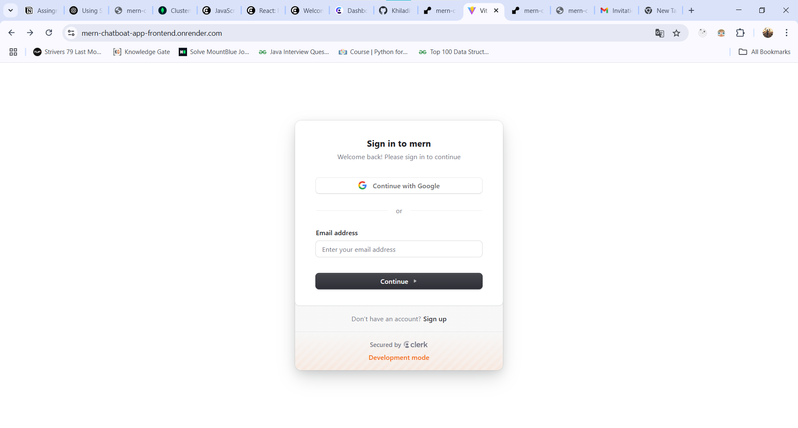
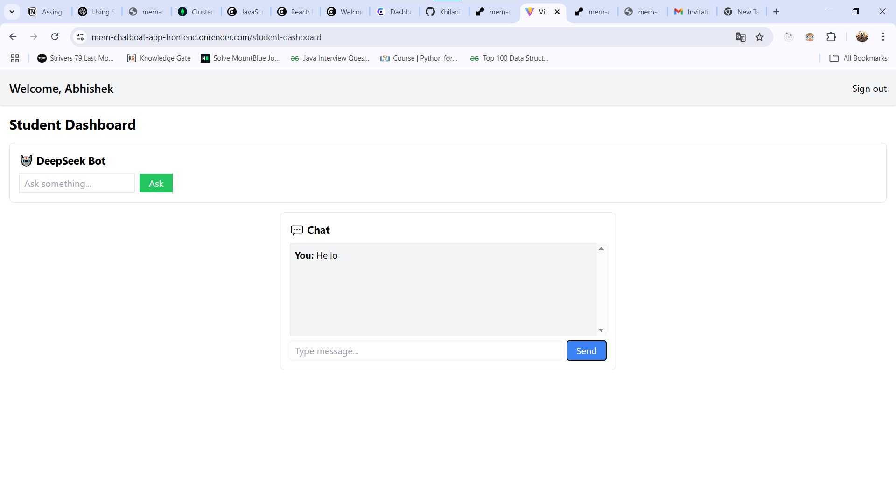

# MERN Chat Application

A full-stack **MERN** (MongoDB, Express.js, React.js, Node.js) application with **real-time chat functionality** and **user authentication**.

---

## ⚙️ Tech Stack

**Frontend:**
- React.js (Vite)
- TailwindCSS
- Axios
- React Router

**Backend:**
- Node.js
- Express.js
- MongoDB
- Clerk Authentication

---

## ✨ Features

- 🔐 User Authentication
- 💬 Real-time Chat System
- 👥 Admin/User Role-based Access
- ⚛️ Modern Frontend with React.js + Vite
- 🎨 TailwindCSS for sleek UI design
- 📦 Backend API with Express.js + MongoDB

## 📁 Project Structure

mern-app-/ ├── client/ # Frontend (React + Tailwind) ├── server/ # Backend (Express + MongoDB) └── README.md

---


## 🖼️ Screenshots

### Sign-in Page


###  Student

---

## 🌐 Live Demo

👉 [Click here to view live demo](https://mern-chatboat-app-frontend.onrender.com/)

---

## 🚀 Getting Started

### 1. Clone the Repository

```bash
git clone https://github.com/Khiladi19/mern-chatboat-app.git
cd mern-chat-app
```

---
cd server
npm install
Create .env file and add your MongoDB URI and other env vars
npm start

---

cd client
npm install
npm run dev

---

Backend (server/.env)
.enn
MONGO_URI=your_mongodb_connection_string
PORT=5000
JWT_SECRET=your_secret

Frontend (client/.env)
VITE_CLERK_PUBLISHABLE_KEY=your_clerk_publishable_key
VITE_API_BASE_URL=http://localhost:2000


📦 Deployment
You can deploy the app using:

Frontend: Render

Backend: Render

Database: MongoDB Atlas

---

👨‍💻 Developed by
Abhishek Kumar

🔗 [Connect with me on LinkedIn](https://www.linkedin.com/in/abhishek-kumar193/)

📝 License
This project is open-source and free to use.

🙌 Thank You
Thanks for checking out this project! 😊

